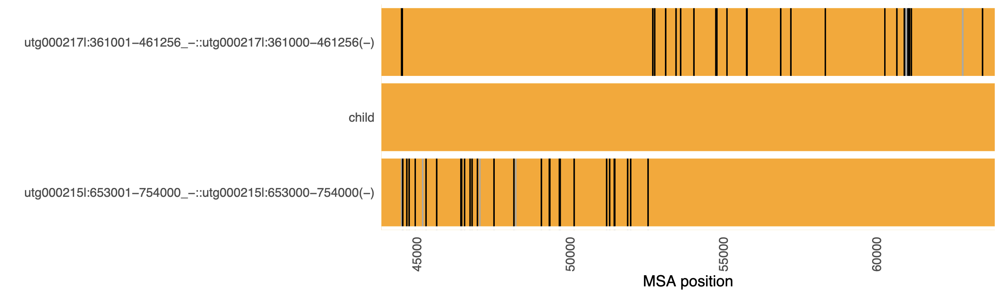

# breakpoint_msa

This repository contains code used in **Höps et al. (2026)** to
identify and visualize likely breakpoint positions between three highly
similar nucleotide sequences.

`breakpoint_msa` is a lightweight R-based tool designed for exploratory
breakpoint analysis in genomic regions ranging from a few hundred base
pairs up to \<100,000 bp.

------------------------------------------------------------------------

## Overview

This tool performs a multiple sequence alignment of **exactly three
sequences** and generates a visualization of mismatch patterns to find putative breakpoint regions.

Typical use case: The approx. breakpoint position is already known (e.g. from crosshair) but we want to confirm and fine-grain. 

An example visualization from a sample from Höps et al. is shown below:

------------------------------------------------------------------------

## How It Works

-   Alignment is performed using the `DECIPHER` multiple sequence
    alignment implementation in R.
-   Mismatch patterns are extracted from the alignment.
-   A custom R plotting routine visualizes the comparative mismatch
    structure along sequence coordinates.

## Input Requirements

I usually used the script interactively in Rscript.
The script requires:

### 1. `seqs_fasta.fa`

A FASTA file containing **exactly three nucleotide sequences**: - Nearly
equal length - Typically a few hundred to \<100,000 bp - Pre-trimmed to
the homologous region of interest

### 2. `reference_seqname`

The exact name (FASTA header) of the sequence that should be displayed
in the **middle** of the plot.\
This is typically the rearrangement-carrying sequence.

------------------------------------------------------------------------

## Usage

Currently not highly automated. Open in Rscript, edit your paths, run. Please let me know if you have any issues. 

------------------------------------------------------------------------

## Scope and Intended Use

This repository primarily serves to document and reproduce the
breakpoint analyses performed in Höps et al. 2026. It is intended as a transparent and reproducible analytical utility
rather than a general-purpose software package.

------------------------------------------------------------------------

## License

Please see the `LICENSE` file for details.
